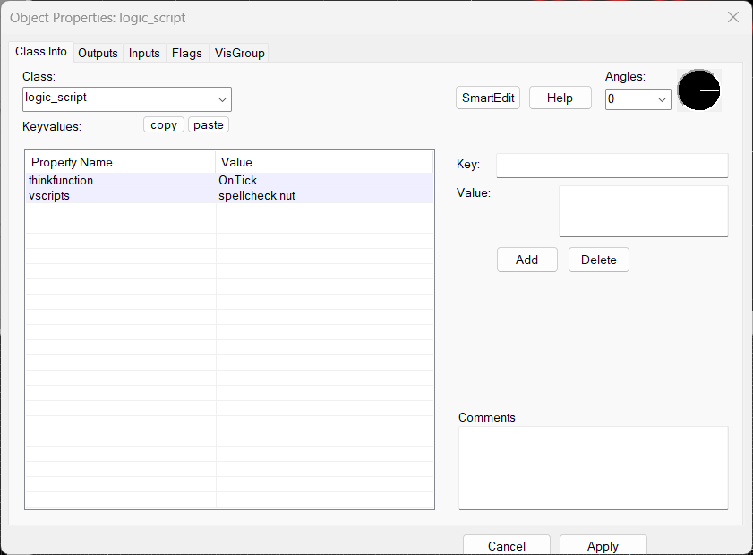
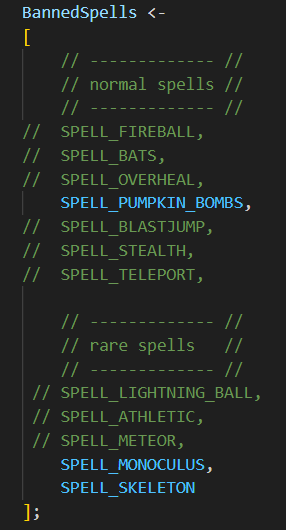

# vscript-spell-banlist
 add halloween spells to a banlist and swap them out automatically for an appropriate substitute

free to use for anyone for commerical or non commerical

to make this work all you need to do is:

1) place this file at \YOUR-STEAM-DIRECTORY\steamapps\common\Team Fortress 2\tf\scripts\vscripts\spellcheck.nut

2) create a logic_script node in your level that has the following keyvalues:

thinkfunction - OnTick
vscripts      - spellcheck.nut

here's an image of how it should look (with smart edit disabled)

3) to configure which spells you want to disable, simply comment/uncomment spell names in the BannedSpells array

in this example, pumpkin bombs monoculus and skeleton hoarde are all banned and will be swapped out if rolled.

optionally this script will put the hightower teleport spell in to the pool as a replacement for a banned spell, this is disabled by default

by default the script bans no spells so be sure to edit it
